# Django 의 ORM 의 Query 는 어떻게 동작하는가


## 프로젝트 소개

Django 는 evaluate orm 으로 관련해서 공식 문서가 존재한다.

하지만 문서는 있지만 본인이 직접적으로 어떻게 동작하는지는 알아본 적이 별로 없을 것이다.

어쩌면 이 부분에 대해 모르는 경우도 있을 것이다.

그래서 직접적으로 구현해서 어떻게 동작하는 지 보여주기 위해서 프로젝트를 시작했다.


## 사용방법

해당 프로젝트는 poetry 로 패키지 관리를 하고있다.

그렇기에 poetry 를 통해서 패키지를 관리를 해도되고 requirements.txt 를 통해서 가상환경에서 작업을 해도 된다.

추천하는 방법은 poetry 로 하는 것이다.

shell command 는 순서대로 입력하면 된다.

```shell
python manage.py makemigrations
python manage.py migrate
python manage.py runserver 0.0.0.0:8000
```

웹 브라우저에서 http://localhost:8000/lab/main 으로 접근하면 해당 프로젝트가 제공하는 기능을 볼 수 있다.


- 기존에는 Data 가 없기 때문에 Reset 을 진행 후 시작을 해야 한다.

- 아무래도 Create, Delete 문을 수행하면 기존 데이터에서 변경이 많이 되어지기 때문에 오류 발생시 Reset을 이용하면 된다.

- Django Debug Toolbar를 이용해서 Query를 보기 때문에 GET을 통해서 작업을 한다.
- 만약에 직접하기 귀찮다면 아래의 내용을 보면 된다.
- 아무래도 짧은 시간에 글 까지 쓰는 것을 목표로 두어서 퀄리티가 별로이기에 문제가 발생할 수 있다.

## Retrieve

### None Active Query

아래 내용을 보면 ORM 을 통해서 조회를 했지만 실질적으로 Query가 동작했던 것은 GET 하나였다.

이것을 봤을 때 우리는 두 가지 사실을 알 수 있다.

하나는 ORM 을 작성했다고 해서 모든 Query가 즉시 동작하는 것은 아니다.

또, 하나는 GET은 작성 후 바로 동작한다는 것이다. 이것은 사실 이미 경험해서 아는 부분이 있을 수도 있다.

ex) get()을 통해서 조회를 했지만 해당 데이터가 없으면 에러, get() 을 통해서 조회했지만 데이터가 2개 이상이면 에러

#### All

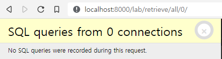

```python
dumps = Dump.objects.all()
```


#### Filter


```python
dumps = Dump.objects.filter(name='test_dump')
```


#### Get

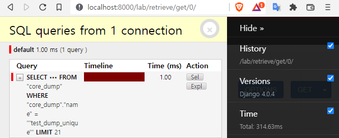

```python
dumps = Dump.objects.get(name='test_dump_unique')
```


### Active Query

이번에는 print 문을 통해서 해당하는 데이터를 출력했다.

결과는 Query가 돌아갔고 이것이 의미하는 바는 크다. 직접적으로 Query가 동작하는 시점은 해당 데이터가 호출이 되는 시점이라는 것이다.

만약에 본인이 ORM을 작성 후 해당하는 ORM으로 생성되어진 데이터를 호출할 일이 없다면 해당하는 Query는 동작할 일이 없다는 것이다.

#### All

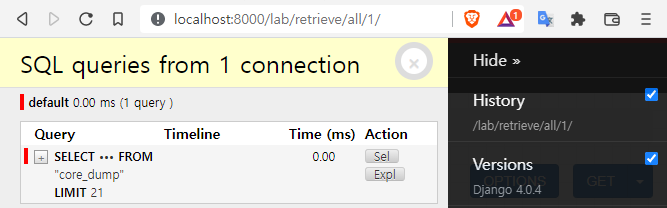

```python
dumps = Dump.objects.all()
print(dumps)
```


#### Filter

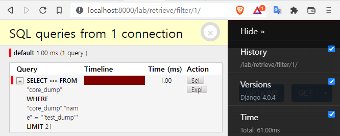

```python
dumps = Dump.objects.filter(name='test_dump')
print(dumps)
```


#### GET

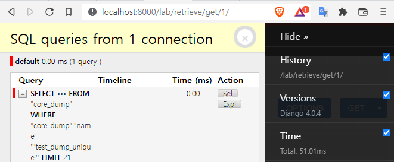

```python
dumps = Dump.objects.get(name='test_dump_unique')
print(dumps)
```


## Detail Retrieve

우리는 전체 조회에 대해서 알아봤다.

그렇다면 단일로 조회할 때에는 어떻게 동작하는지 알아보자.

여기에서 유일하게 다른 결과를 내는 방법이 있다.

그것은 리스트의 인덱스를 통해서 각각 조회하는 방식인데 다른 방식 Query가 하나만 있는 반면, 인덱스 접근 방식은 100개의 Query가 동작하는 것을 알 수 있다.

이것을 봤을 때 인덱스 형식으로 접근하는 방법은 유용한 방법이 아님을 알 수 있다. 

#### Full

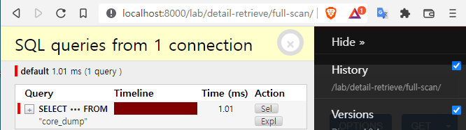

```python
dumps = Dump.objects.all()
    for dump in dumps :
        dump
```


#### Each

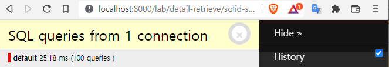

```python
dumps = Dump.objects.all()
    for i in range(100):
        dumps[i]
```


#### Bool

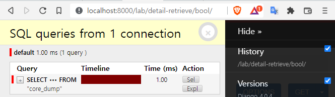

```python
dumps = Dump.objects.all()
    if dumps:
        dumps[50]
        dumps[99]
```


#### Wrap

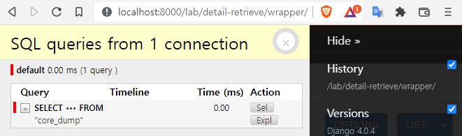

```python
dumps = Dump.objects.all()
list(dumps)
dumps[50]
dumps[1]
```


## Update

수정은 크게 세 가지의 방식으로 이루어졌다.

조회 후 각각 update 하는 방식, 조회 후 변경을 매니저를 통한 bulk_update 방식, 조회와 변경을 매니저에서 일괄 처리

결과는 크게 다른 것을 볼 수 있다.

각각 처리하는 방식의 경우 조회된 row 수 만큼의 Query가 생성된 반면에

bulk_update는 조회와 수정으로 2 개의 Query 가 생성되어졌고

update 는 Query가 1개가 생성되어진 것을 볼 수 있다.

그렇다면 우리는 각각 변경하는 방식보다는 Manager 를 통한 Update 방식을 사용하는 것이 유용하다는 것을 알 수 있다.

#### Bulk By Object

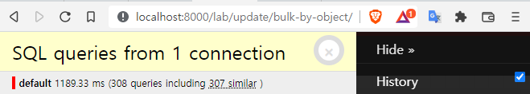

```python
dumps = Dump.objects.all()
    for dump in dumps:
        dump.name = 'test_dump'
        dump.save()
```


#### Bulk By Manager(bulk_update)

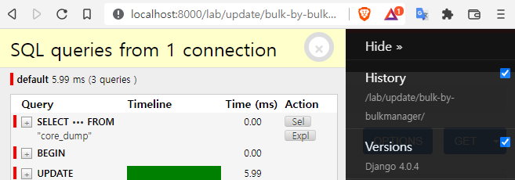

```python
dumps = Dump.objects.all()
for dump in dumps:
    dump.name = 'test_dump'
    Dump.objects.bulk_update(dumps, fields=['name'])
```


#### Bulk By Manager(Update)

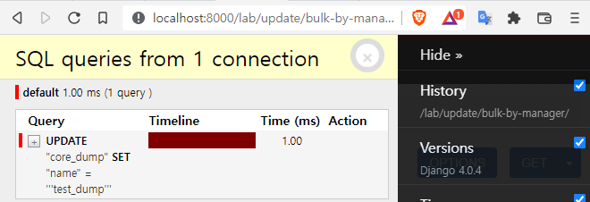

```python
Dump.objects.all().update(name='test_dump')
```


## Create

생성은 크게 두 가지와 세부적인 두 가지로 나뉘었다.

첫번째는 대량 생성 시 Manager bulk_create 를 통한 생성과 각각 Manager create 를 이용한 방식이고

두번째는 단일 생성 시 Model 을 통한 생성과 Manager create 를 이용한 방식이다.

첫번째의 결과는 bulk_create를 이용시에는 하나의 Query, create 를 이용시에는 생성하고자하는 개수만큼 생성

두번째의 결과는 Model() 형식으로 한 경우에는 Query가 없고, Manager 는 Query를 하나 만드는 것이다.

여러개의 데이터를 생성한다면 bulk_create 를 이용하는 것이 유용하며

단일 데이터를 생성시에는 Model 로 생성시에는 save() 를 잊지말아야 한다.

#### Bulk By Manager

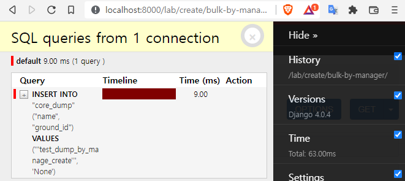

```python
dump_bulks = [Dump(name = 'dump_test_bulk') for i in range(100)]
Dump.objects.bulk_create(dump_bulks)
```


#### Bulk By Object

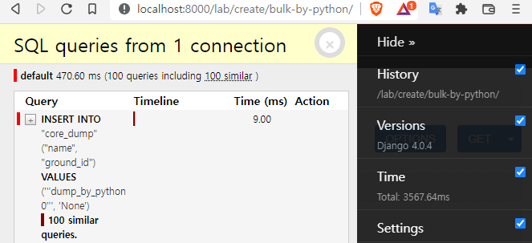

```python
dump_bulks = [i for i in range(100)]
for item in dump_bulks:
    Dump.objects.create(name=f'dump_by_python{item}')
```


#### By Object

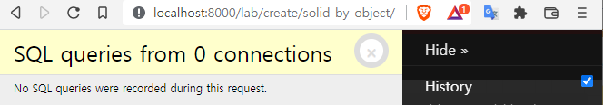

```python
Dump(name='test_dump_by_object')
```


#### By Manager

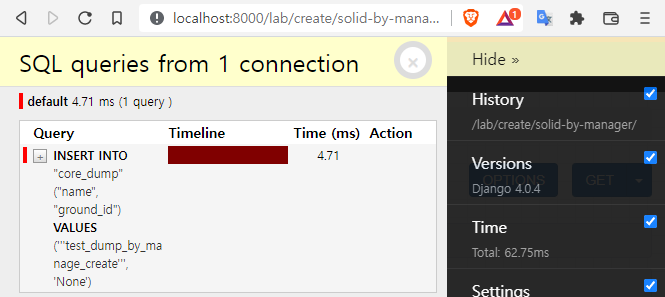

```python
Dump.objects.create(name='test_dump_by_manage_create')
```


## Delete

Manager 를 통한 삭제 방식과 각각 삭제하는 방식이 있다.

이것도 위의 결과와 비슷하게 Manager 를 통해서 삭제하는 방식은 조회와 삭제를 한번에 할 수 있고

객체로 접근해서 하는 방식은 조회된 갯수만큼 Query가 동작한다.

상황에 맞게 더욱 더 유용한 방식을 이용하는 것이 필요하다.

#### By Manager

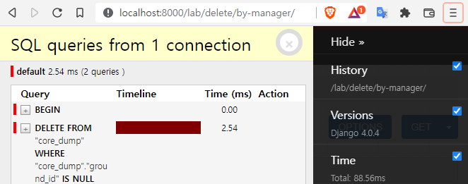

```python
dumps = Dump.objects.filter(ground_id=None)
dumps.delete()
```


#### By Object

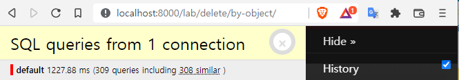

```python
dumps = Dump.objects.filter(ground_id=None)
for dump in dumps:
    dump.delete()
```


## Join

외래키를 통해서 연결되어 있는 테이블에 대한 접근은 어떻게 되나 보자

아무것도 설정을 안 한 경우에는 재미있다.

먼저 Dump Table 을 조회 후 Dump Table 연결된 Ground Table을 row 수 만큼 조회를 한다.

100(Ground Table) + 1(Dump Table) Query 가 생성된 것이다.

두번째로는 Prefetch 이다. 먼저 Dump Table을 조회하고 Ground Table 을 Where 문을 통해서 조회한다.

1(Dump Table) + 1(Ground Table) Query 가 생성되어진다. 이것을 Django 내부에서 조합 후 결과값을 낸다.

세번째로는 Selected 이다. Dump Talbe을 조회할 때 Join 문을 통해서 조회를 한다.

그래서 Query 는 하나만 생성이 되어진다.

만약에 연결되어있는 테이블을 조작할 일이 있다면 prefetch 와 selected 를 선택해서 조작하는 것이 도움이 될 것 이다.

#### None

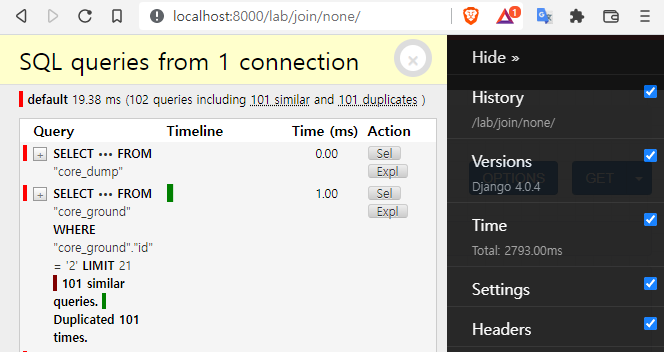

```python
dumps = Dump.objects.all()
for dump in dumps:
    dump.ground
```


#### Prefetch

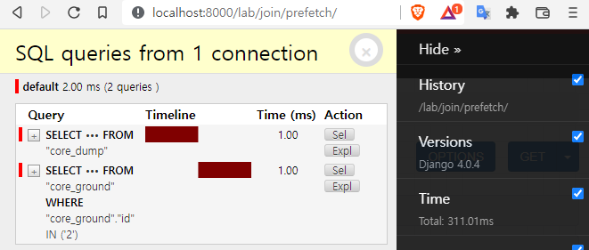

```python
dumps = Dump.objects.all().prefetch_related('ground')
for dump in dumps:
    dump.ground
```


#### Selected

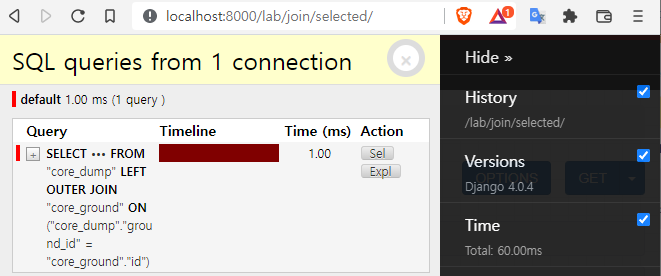

```python
dumps = Dump.objects.select_related('ground').all()
for dump in dumps:
    dump.ground
```

